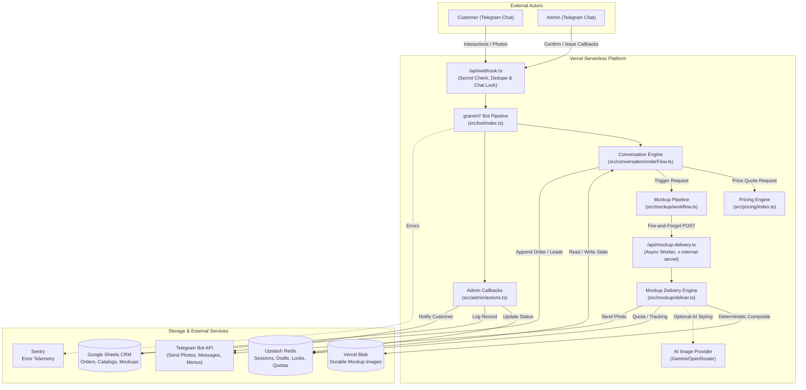
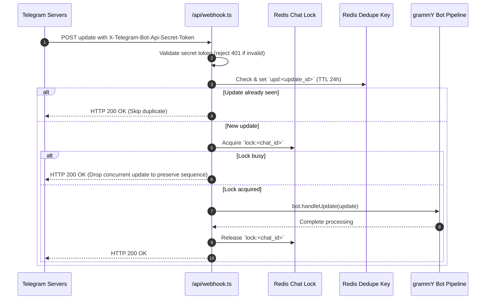

# System Architecture (`docs/ARCHITECTURE.md`)

This document provides a technical deep-dive into the Custom Teamwear Bot architecture, component interactions, security model, and data storage design.

---

## 1. High-Level Component Architecture

The system operates as a serverless, event-driven pipeline on Vercel, interfacing with Telegram, Upstash Redis, Google Sheets CRM, and Vercel Blob storage:

---

## 2. Webhook Request Lifecycle

Telegram posts updates to `/api/webhook.ts`. The handler guarantees fast response times, idempotent execution, and serialized per-chat processing:

---

## 3. Mockup Subsystem & Async Delivery

Mockup generation is computationally expensive (30–60s+) and exceeds grammY's 25s webhook budget. Thus, it is isolated into an asynchronous delivery pipeline.

- **Trigger (`deliverTrigger.ts`)**: `orderFlow.ts` or an Admin Paid-Approval dispatches a fire-and-forget POST to `/api/mockup-delivery`.
- **Worker (`mockup-delivery.ts`)**: Protected by `x-internal-secret`. Uses Vercel's `waitUntil` to safely execute the long-running composite task.
- **Composition (`composite.ts`)**: The authoritative print proof is deterministic—generated by Sharp compositing the original logo bytes onto the confirmed catalog image.
- **AI Enhancement (`generateAi.ts`)**: An optional AI-styled visualization using an `ImageProvider` (Gemini or OpenRouter). This never replaces the deterministic proof.
- **Quota Management**: Handled via Redis (`mockupquota:*`). First 3 generations per Kolkata month are free; subsequent require admin paid-approval.

---

## 4. Storage Architecture & Schemas

### 4.1 Upstash Redis Topologies
Redis holds transient and semi-persistent conversational state using standard namespaces:

| Key Pattern | Type | TTL | Purpose |
|---|---|---|---|
| `upd:<update_id>` | string | 24 hours | Deduplication marker for incoming webhook updates |
| `lock:<chat_id>` | string | 15 seconds | Distributed mutex preventing race conditions for same user |
| `sess:<chat_id>` | string (JSON) | 24 hours | Active grammY conversation session state and checkpoint |
| `draft:<chat_id>` | string (JSON) | 24 hours | Transient order builder storing choices before final submission |
| `order:<order_id>` | string (JSON) | Persistent | Immutable snapshot of confirmed/submitted order |
| `oid:YYMMDD` | integer | 48 hours | Daily atomic counter (`INCR`) generating order IDs (`YYMMDD-XXXX`) |
| `mockup:quota:<chat_id>:<YYYY-MM>`| integer | 35 days | Mockup counter per chat for the Kolkata calendar month |
| `mockup:gen:<generation_id>` | string (JSON) | Persistent | State record of a mockup generation request |

---

### 4.2 Google Sheets CRM Schemas

All writes pass through `src/sheets/safeAppend.ts` with sanitization to prevent CSV/formula injection:

#### Tab 1: `Orders`
Persistent ledger for all orders and abandoned/disqualified leads.
- **Columns**: `Timestamp`, `Order ID`, `Status`, `Customer Name`, `Phone`, `City`, `Tier`, `Product`, `Confirmed Catalog Style`, `Qty`, `Size Split`, `Print Method`, `Timeline`, `Garment Total (₹)`, `Print Est Low (₹)`, `Print Est High (₹)`, `Grand Total Low (₹)`, `Grand Total High (₹)`, `Advance Due (₹)`, `Chat ID`, `Admin Notes`.

#### Tab 2: `Catalog Selections`
Traceability for exact catalog styles picked by customers:
- **Columns**: `Timestamp`, `Order ID`, `Catalog Version`, `Tier`, `Group ID`, `Group Label`, `Item ID`, `Item Label`, `Product ID`, `Garment Type`, `Source PDF ID`, `Source Page`, `Style Code`, `Color Name`, `Color Code`, `Reference Image Path`, `Reference Kind`.

#### Tab 3: `Mockup Generations`
Tracks all mockup requests, quotas, and admin payment approvals:
- **Columns**: `Timestamp`, `Generation ID`, `Order ID`, `Customer Chat ID`, `Status`, `Free / Paid`, `Amount (₹)`, `Month Key`, `Style Picked`, `Reference Image`, `Requested Views`, `Logos Rendered`, `Output URLs`, `Payment Proof File ID`, `Approved By Admin ID`, `Completed At`, `Failure Reason`.

---

## 5. Security & Safety Model

1. **Telegram Secret Token Check**:
   - Registered using `setWebhook` with `secret_token = WEBHOOK_SECRET`.
   - Every incoming request to `/api/webhook.ts` is checked:
     `req.headers['x-telegram-bot-api-secret-token'] === WEBHOOK_SECRET`. Mismatches receive an immediate `401 Unauthorized`.
2. **Formula Injection Shield**:
   - `sanitizeForSpreadsheet()` strips `= + - @` from the start of every text string before writing to Google Sheets.
3. **Server-Side Authority for Money & Status**:
   - Clients never send prices or status values. All pricing is computed via pure functions in `src/pricing/`.
   - Order transitions are validated against `src/session/statusMachine.ts`.
4. **Admin Route Authorization**:
   - Admin operations (confirming payments, approving paid mockups) check `ADMIN_CHAT_IDS.includes(ctx.from.id)`. Any unauthorized attempt is rejected and logged.
5. **Fail-Safe Admin Escalation**:
   - If Google Sheets API fails or encounters quota limits, the system catches the error and sends the full unformatted order data directly to the admin Telegram chat so no lead is lost.
