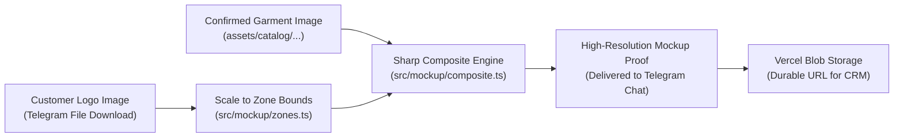

# Catalog & Deterministic Mockup Pipeline (`docs/CATALOG_AND_MOCKUP_SYSTEM.md`)

This document explains how the garment catalog is extracted and structured, how deterministic visual mockups are generated using Sharp, and how monthly customer quotas are tracked.

---

## 1. Catalog Generation & Architecture

The catalog system bridges high-resolution brand PDFs into structured bot menus with exact visual previews.

### 1.1 Extraction Pipeline (`scripts/generate-catalog.ts`)
Source catalogs reside in `quality/` as high-resolution manufacturer PDFs:
- `quality/Basic/` (Cotton polo, cotton round neck, drifit polo, drifit round neck)
- `quality/Standard polo/` (Drifit polo, standard cotton polo)
- `quality/Premium/` (Adidas, Reebok, Stellars, Van Heusen)

Running `npm run generate-catalog`:
1. Uses `mupdf` to render PDF pages into JPEG format (`assets/catalog/<brand-folder>/page-XXX.jpg`).
2. Extracts color swatches and style identifiers.
3. Merges manual refinements from `src/catalog/data/overrides.json` (such as verified GSM, style names, and swatch associations).
4. Emits `src/catalog/data/catalog.generated.json`.

```
quality/*.pdf
      │
      ▼ (mupdf rasterization)
assets/catalog/brand-folder/page-001.jpg
      │
      ▼ (merge with overrides.json)
src/catalog/data/catalog.generated.json
      │
      ▼
src/catalog/index.ts (API queries for bot menus)
```

### 1.2 Catalog Data Model (`src/catalog/types.ts`)
- **`CatalogTier`**: Basic, Standard, or Premium.
- **`CatalogGroup`**: Represents a brand or primary collection (e.g. `adidas`, `stellars`, `basic-cotton`).
- **`CatalogItem`**: Specific garment style (e.g. `adidas-club-polo`, `drifit-round-neck`).
  - Contains `sourceId`, `sourcePage`, `previewImagePath`, `variants`.
- **`CatalogVariant`**: Specific color option (e.g., Navy Blue, Heather Grey, Royal Blue).
  - Contains `colorName`, `colorCode`, and `imagePath`.

---

## 2. Deterministic Sharp Mockup Compositing

Unlike unpredictable generative AI image models that alter garment details, colors, or fabrics, this project uses **pixel-accurate deterministic compositing** via `sharp`:

### 2.1 The Compositing Process (`src/mockup/composite.ts`)
1. **Garment Base Layer**:
   - The exact confirmed color image from `assets/catalog/` is loaded into Sharp.
   - If no catalog selection was made (legacy fallback), a blank template from `assets/mockup-templates/` is used.
2. **Logo Processing**:
   - The user's uploaded logo is downloaded from Telegram via `bot.api.getFile()`.
   - Sharp inspects logo dimensions and automatically converts non-PNG formats or trims transparent edges if needed.
3. **Zone Mapping & Coordinate Calculation (`src/mockup/zones.ts`)**:
   - Every silhouette (`round_neck`, `polo`) has defined pixel boundaries for each placement zone:
     - `left_chest`: Standard 3.5" to 4" chest logo area.
     - `center_chest`: Wide front chest placement.
     - `upper_back`: Yoke/upper back branding.
     - `full_back`: Large team name or jersey numbering.
     - `left_sleeve` & `right_sleeve`: Centered outer sleeve placements.
4. **Bounding Box Fitting**:
   - The logo is scaled to fit comfortably inside the target zone bounding box while preserving aspect ratio.
5. **Alpha Compositing**:
   - `sharp(garmentBase).composite([{ input: resizedLogoBuffer, left: posX, top: posY }])`.
6. **Output**:
   - Emits a high-fidelity JPEG/PNG proof delivered back to the customer Telegram chat.



---

## 3. Mockup Quota & Paid Approval System

To prevent abuse while offering a frictionless sales experience, the system enforces a strict monthly quota:

### 3.1 Free Tier (3 Free per Month)
- Tracked via Redis key: `mockup:quota:<chat_id>:<YYYY-MM>`.
- The month key is computed against the **Asia/Kolkata** timezone (`YYYY-MM`), resetting automatically on the 1st of each month at 00:00 IST.
- When `currentCount < 3`:
  - Request is reserved as `free: true`, `amountInr: 0`.
  - Composite generated immediately.
  - Quota counter incremented.

### 3.2 Paid Tier (#4+ Requests)
- When `currentCount >= 3`:
  - System prompts customer: `"You have reached your 3 free mockup designs for this month. Additional mockups require a nominal ₹20 deposit."`
  - Sends ₹20 UPI QR code.
  - Customer uploads payment screenshot.
  - State moves to `awaiting_approval`.
  - Admin receives alert with Approve / Reject buttons.
  - Upon admin **Approve**: Composite generates and delivers to customer; slot committed.
  - Upon admin **Reject**: Request terminated; reason logged.

---

## 4. Durability & Vercel Blob Storage

- Generated images are optionally mirrored to Vercel Blob (`@vercel/blob`) via `src/storage/blob.ts`.
- The durable public URL is recorded in the `Mockup Generations` and `Orders` tabs of the Google Sheets CRM.
- If Vercel Blob is unconfigured (e.g. local testing without blob token), the pipeline falls back gracefully to sending the image buffer directly to Telegram without failing.
