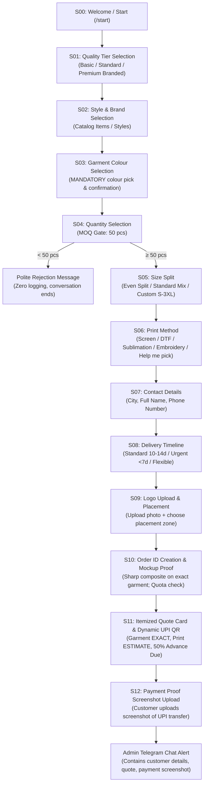
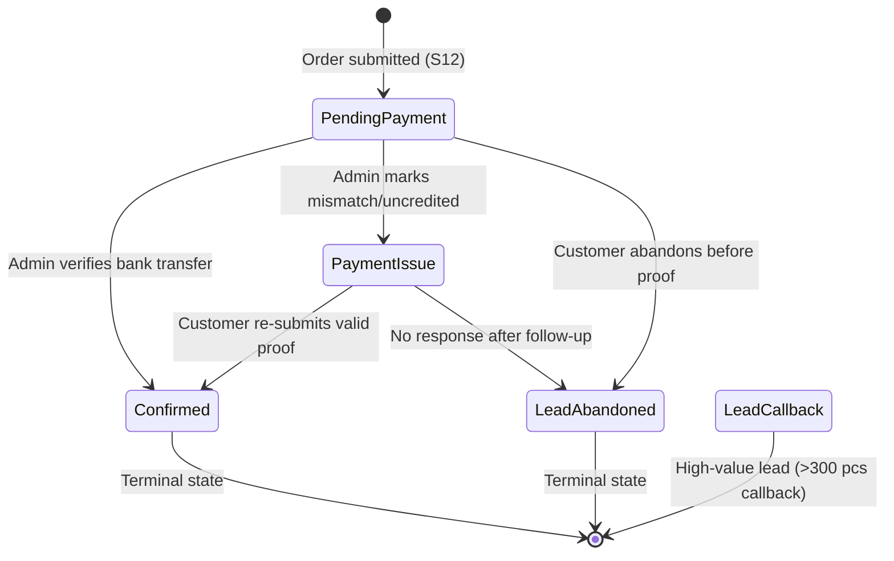
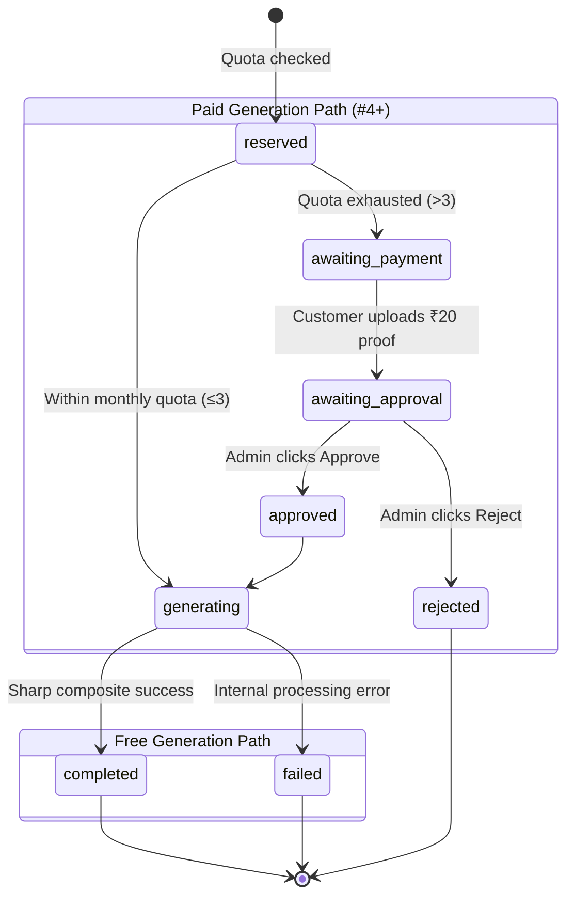

# Conversation State Machine & Step Flows (`docs/STATE_MACHINE_AND_FLOWS.md`)

This guide details the conversational state machine, screen-by-screen steps (S00 to S12), status transitions, and draft order lifecycle.

---

## 1. Conversation Screen Flow (S00 to S12)

The customer flow is implemented in `src/conversation/orderFlow.ts` using `@grammyjs/conversations`:

---

## 2. Detailed Screen Breakdown

### S00: Welcome & Entrypoint
- Triggered by `/start` or the first message.
- Explains bulk order parameters: **MOQ 50 pcs**, pan-India delivery, garment advance via UPI.
- Displays inline button: `"Build my teamwear quote"`.

### S01: Tier Selection
- Options:
  1. `Basic` — Economical (Cotton / Poly-cotton / Dry Fit)
  2. `Standard Polo` — Heavyweight 240+ GSM pique cotton / premium performance dry fit
  3. `Premium Branded` — Adidas, Reebok, Stellars, Van Heusen
- Back navigation returns to S00.

### S02: Brand & Style Selection
- Fetches available items from `src/catalog/index.ts`.
- Customer reviews photos from the catalog PDF page (`assets/catalog/`).
- Shows garment image with buttons to confirm style or view other styles in the tier.

### S03: Colour Selection (Mandatory Gate)
- Shows available colours for the chosen style code with preview swatches/photos where available.
- **Invariant**: The customer **cannot proceed** without choosing and confirming an exact colour.
- Stores `colorName`, `colorCode`, and `referenceImagePath` into the draft order.

### S04: Quantity Selection (MOQ Gate)
- Quick buttons: `50`, `60`, `100`, `150`, `250`, `500+` or `Enter custom quantity`.
- **Validation**:
  - `qty < 50`: Triggers funny/polite rejection copy (`copy.ts`), ends conversation without creating a lead.
  - `qty > 300`: Unlocks a `"Talk to a Human"` callback option.

### S05: Size Split Selection
- Pre-set ratios available:
  - **Even Split**: Distributes total evenly across S, M, L, XL, 2XL (remainder placed in L).
  - **Standard Mix**: Indian corporate bell curve (15% S, 30% M, 35% L, 15% XL, 5% 2XL).
  - **Enter my own**: Interactive text prompt parsing individual sizes (`S:10, M:20, L:30...`).
- Guarantees `sum(sizes) === qty`.

### S06: Print / Branding Method
- Buttons:
  - `Screen Printing` (ideal for bulk spot colors)
  - `DTF (Direct to Film)` (full color gradients & complex logos)
  - `Sublimation` (all-over print for dry fit)
  - `Embroidery` (premium stitched look)
  - `Not sure / Recommend for me` (defaults to DTF estimate)

### S07: Contact Details
- Collects:
  1. **City / Pin code** (validates length ≤ 40)
  2. **Customer Name** (validates length ≤ 60)
  3. **Phone Number** (accepts Indian mobile numbers, normalized to 10 digits or +91 format)

### S08: Delivery Timeline
- Buttons:
  - `Standard (10-14 days)`
  - `Urgent (< 7 days)` (flags `timelineUrgent: true` for priority handling)
  - `Flexible (15+ days)`

### S09: Logo Upload & Placement
- Customer sends an image/document of their logo.
- Bot prompts for placement zone:
  - `Left Chest`
  - `Center Chest`
  - `Upper Back`
  - `Full Back`
  - `Left Sleeve`
  - `Right Sleeve`
- Supports adding multiple logos or proceeding with one.

### S10: Order ID Assignment & Deterministic Mockup
- Order ID is generated atomically via Redis `INCR oid:YYMMDD` (e.g. `260910-0012`).
- Mockup Pipeline checks monthly quota (`mockup:quota:<chat_id>:<YYYY-MM>`):
  - **Free Mockup (Count ≤ 3)**: Generated instantly via Sharp using the confirmed garment photo from S03.
  - **Paid Mockup (Count ≥ 4)**: Requires ₹20 token deposit; transitions to awaiting payment and admin approval.
- Delivered to the customer in Telegram before demanding payment.

### S11: Itemized Quote Card & Dynamic UPI QR
- Displays the single-template Quote Card rendered by `renderQuoteCard()`:
  - Garment Total: **Exact** (calculated via `calculateQuote()`)
  - Branding Estimate: **Price Range** (e.g., ₹2,500 – ₹4,000)
  - Advance Due: **~50% of Garment Total** (via `Math.ceil`)
- Sends dynamic UPI QR image (`upi://pay?pa=...&pn=...&am=...&tn=Order-260910-0012`).

### S12: Payment Screenshot & Admin Dispatch
- Customer uploads a screenshot of the completed UPI transfer.
- Order record is created in Redis (`order:<order_id>`) and appended to Google Sheets (`Orders` tab).
- Instant notification with quick action buttons (`Confirm ✅`, `Payment Issue 🚩`) dispatched to all admin IDs in `ADMIN_CHAT_IDS`.

---

## 3. Order Status State Machine (`OrderStatus`)

Defined in `src/session/statusMachine.ts`. Transitions are strictly forward-only:

### Transition Validation Rules
- **No Backward Transitions**: An order in `Confirmed` can never be reverted to `Pending Payment` or `Payment Issue`.
- **Terminal States**: `Confirmed` and `Lead — Abandoned` reject all future transitions.
- **Idempotency**: Attempting to transition to the exact same status is rejected as a no-op.

---

## 4. Mockup Generation State Machine (`MockupGenerationStatus`)

Defined in `src/shared/types.ts` and managed in `src/mockup/paidGeneration.ts`:

---

## 5. Draft vs Session Lifecycle

- **`draft:<chat_id>`**:
  - Holds progressive fields as the customer taps buttons (`tier`, `productId`, `colorCode`, `qty`, `sizeSplit`).
  - Cleared upon successful submission into a permanent `order:<order_id>`.
  - Auto-expires after 24 hours of inactivity.
- **`sess:<chat_id>`**:
  - Internal grammY conversation state tracking which step handler is awaiting response.
  - Allows conversations to safely resume across serverless cold starts.
